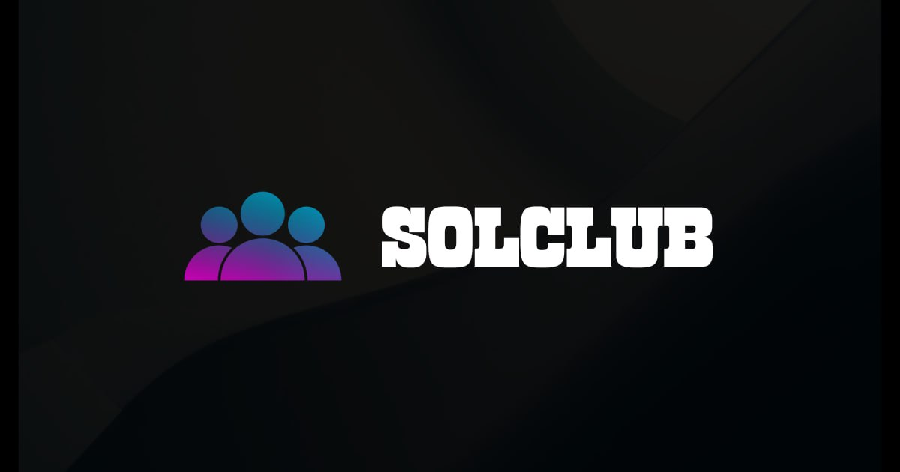

# SolClub

SolClub is a decentralized network of communities where people can dive into their interests, hobbies and passions powered by Solana. There's a community for whatever you're interested in on SolClub.

# Abstract 

Solclub is a blockchain database that supports community building and social interaction with cryptocurrency rewards. Solclub combines concepts from social media with lessons learned from building cryptocurrencies and their communities. An important key to inspiring participation in any community, currency or free market economy is a fair accounting system that consistently reflects each person's contribution. Solclub is the cryptocurrency that attempts to accurately and transparently reward an unbounded number of individuals who make subjective contributions to its community.

#About SolClub
The social media landscape is changing. In an era of distrust and perfectly-polished online personas, tools that are supposed to bring us together are often making us feel more isolated and distant from one another. 

At SolClub however, we've noticed something different. From page views to time spent on our site and apps, over the past year we've seen significant growth in user engagement and conversations-demonstrating that users are deepening their relationships with each other and with SolClub communities. Our users are finding more reasons to visit SolClub, more reasons to become active members of our communities, and more reasons to share the ideas they glean with others.

SolClub is designed from the ground up to address the major barriers to adoption and monetization of a social media based economy. Our thesis is that the same techniques used to grow major social media platforms can be used to bootstrap a successful cryptocurrency. Economic incentives enabled by cryptocurrency can dramatically facilitate the growth of a new social media platform. It is the synergy between cryptocurrency and social media that we believe may give SolClub a powerful advantage in the market. 

The challenge faced by SolClub is deriving an algorithm for scoring individual contributions that most community members consider to be a fair assessment of the subjective value of each contribution. In a perfect world, community members would cooperate to rate each other's contribution and derive a fair compensation. In the real world, algorithms must be designed in such a manner that they are resistant to intentional manipulation for profit. Any widespread abuse of the scoring system could cause community members to lose faith in the perceived fairness of the economic system. 

Existing platforms operate on a one-user, one-vote principle. This creates an environment where rankings can be manipulated by sybil attacks and the service providers must pro-actively identify and block abusers. People already attempt to manipulate the Reddit, Facebook, and Twitter scoring algorithms when the only reward is web traffic or censorship.

## Official Links

- Contract address: [3rUE9f3AYH9gG2z2gNJbAZB1osR3uqPUbRtwhq1tsQhX](https://solscan.io/token/3rUE9f3AYH9gG2z2gNJbAZB1osR3uqPUbRtwhq1tsQhX)
- Website: https://solclub.vip
- Docs: https://docs.solclub.vip
- X: https://x.com/SolClubApp
- Telegram: https://t.me/SolClubPortal

## About $CLUB

- Spec: SPL-Token
- Name: SolClub
- Symbol: CLUB
- Decimal: 9
- Total Supply: 100,000,000
- Address: 3rUE9f3AYH9gG2z2gNJbAZB1osR3uqPUbRtwhq1tsQhX

[Visit our website](https://solclub.vip).
